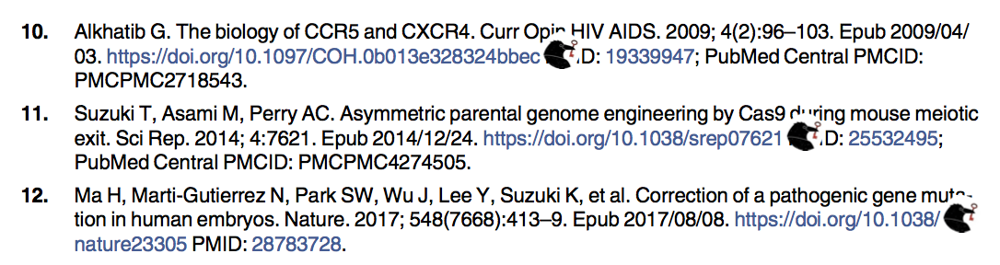

# Add links to Sci-Hub in the reference section of a scientific article

## Context
Publishers increasingly include hypertext links in the reference section of scientific articles, which is a first step in improving the readability of scientific articles. However most of these references are behind paywall.

This script attemps to add links to Sci-Hub next to the orginal links towards the publisher website. 

At this stage this will only work for PDFs with hypertext links for the references, using the DOI system. This is hopefully what all publishers will be doing in a near future. PLoS and eLIFE have done it systematically for recent articles, so it should work with their articles.

## Install 
Using pip (prefered): `pip install add_scihub_links`

Or clone the repository and run `add_scihub_links.py` (requires pdfrw)

Should work with both Python 2 and 3

## Use
Basic use: `add_scihub_links input.pdf output.pdf`

See full documentation with `add_scihub_links -h`

## Example
See an example of the result [here](examples/Wang2019_links.pdf), obtained from [this article](https://doi.org/10.1371/journal.pbio.3000224).

